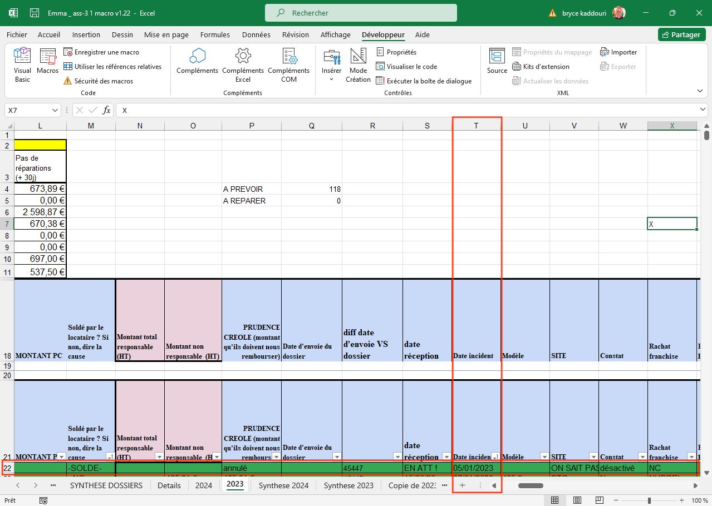

# Documentations des functions 

## 1. CompterDossierparMois

Liste des paramètres de la fonction:
- mois (chiffre entre 1 et 12)
- annee (chiffre)
- nom de la feuille (chaine de caractère)
- cellule de debut pour la date de l'incident (cellule)

Exemple pour le mois d'avril 2023 (la feuille s'appelle "2023" et la cellule de départ est T22):

```excel
=CompterDossierparMois(4;2023;"2023";T22)
```

**T22** correspond a la premiere ligne qui contient les données. un exemple de la feuille "2023" est donné ci-dessous:



---


## 2. CompterAccidentsResponsables

Liste des paramètres de la fonction:
- mois (chiffre entre 1 et 12)
- annee (chiffre)
- nom de la feuille (chaine de caractère)
- cellule de debut pour la date de l'incident (cellule)
- cellule pour la causes de l'accident (cellule)
- cellule pour le debut des données (cellule)

Exemple pour le mois de mai 2023 (la feuille s'appelle "2023" et la cellule de départ est T22):

```excel
=CompterAccidentsResponsables(5;2023;"2023";T22;J22;T22)
```

NB: pour la cellule de debut des données, cest surtout la ligne qui est importante.

---

## 3. CompterAccidentsNonResponsables
Liste des paramètres de la fonction:
- mois (chiffre entre 1 et 12)
- annee (chiffre)
- nom de la feuille (chaine de caractère)
- cellule de debut pour la date de l'incident (cellule)
- cellule pour la causes de l'accident (cellule)
- cellule pour le debut des données (cellule)

Exemple pour le mois de mai 2023 (la feuille s'appelle "2023" et la cellule de départ est T22):

```excel
=CompterAccidentsResponsables(5;2023;"2023";T22;J22;T22)
```

NB: pour la cellule de debut des données, cest surtout la ligne qui est importante.

---

## 4. CompterBDGParMois
Liste des paramètres de la fonction:
- mois (chiffre entre 1 et 12)
- annee (chiffre)
- nom de la feuille (chaine de caractère)
- cellule de debut pour la date de l'incident (cellule)
- cellule pour la causes de l'accident (cellule)
- cellule pour le debut des données (cellule)

Exemple pour le mois de janvier 2023 (la feuille s'appelle "2023" et la cellule de départ est T22):

```excel
=CompterBDGParMois(1;2023;"2023";T22;J22;T22)
```

NB: pour la cellule de debut des données, cest surtout la ligne qui est importante.

---

## 5. CompterRemorquagesParMois

Liste des paramètres de la fonction:
- mois (chiffre entre 1 et 12)
- annee (chiffre)
- nom de la feuille (chaine de caractère)
- cellule de debut pour la date de l'incident (cellule)
- cellule pour la causes de l'accident (cellule)
- cellule pour le debut des données (cellule)

Exemple pour le mois de janvier 2023 (la feuille s'appelle "2023" et la cellule de départ est T22):

```excel
=CompterRemorquagesParMois(1;2023;"2023";T22;J22;T22)
```

NB: pour la cellule de debut des données, cest surtout la ligne qui est importante.

---

## 6. CompterAssuranceParMois

Liste des paramètres de la fonction:
- mois (chiffre entre 1 et 12)
- annee (chiffre)
- nom de la feuille (chaine de caractère)
- cellule de debut pour la date de l'incident (cellule)
- cellule pour la causes de l'accident (cellule)
- cellule pour le debut des données (cellule)

Exemple pour le mois de novembre 2023 (la feuille s'appelle "2023" et la cellule de départ est T22):

```excel
=CompterRemorquagesParMois(11;2023;"2023";T22;J22;T22)
```

NB: pour la cellule de debut des données, cest surtout la ligne qui est importante.

---

## 7. CompterAttMandatParMois

Liste des paramètres de la fonction:
- mois (chiffre entre 1 et 12)
- annee (chiffre)
- nom de la feuille (chaine de caractère)
- cellule de debut pour la date de l'incident (cellule)
- cellule pour le statut (cellule)
- cellule pour le debut des données (cellule)

Exemple pour le mois de novembre 2023 (la feuille s'appelle "2023" et la cellule de départ est T22):

```excel
=CompterAttMandatParMois(11;2023;"2023";T22;E22;T22)
```

NB: pour la cellule de debut des données, cest surtout la ligne qui est importante.

---

## 8. SommeVIRAttRBSTParMois

Liste des paramètres de la fonction:
- mois (chiffre entre 1 et 12)
- annee (chiffre)
- nom de la feuille (chaine de caractère)
- cellule de debut pour la date de l'incident (cellule)
- cellule pour le statutG (cellule)
- cellule pour le statutG (cellule)
- cellule pour le jourS (cellule)
- cellule pour le statutA (cellule)
- cellule pour le MontantP (cellule)


Exemple pour le mois de novembre 2023 (la feuille s'appelle "2023" et la cellule de départ est T22):

```excel
=SommeVIRAttRBSTParMois(11;2023;"2023";T22;G22;S22;A22;P22)
```

---

## 9. SommeRepAttRBSTParMois

Liste des paramètres de la fonction:
- mois (chiffre entre 1 et 12)
- annee (chiffre)
- nom de la feuille (chaine de caractère)
- cellule de debut pour la date de l'incident (cellule)
- cellule pour le statutG (cellule)
- cellule pour le statutG (cellule)
- cellule pour le jourS (cellule)
- cellule pour le statutA (cellule)
- cellule pour le MontantP (cellule)


Exemple pour le mois de novembre 2023 (la feuille s'appelle "2023" et la cellule de départ est T22):

```excel
=SommeVIRAttRBSTParMois(11;2023;"2023";T22;G22;S22;A22;P22)
```

---

## 10. SommeVIRAttRBSTPlus30ParMois

Liste des paramètres de la fonction:
- mois (chiffre entre 1 et 12)
- annee (chiffre)
- nom de la feuille (chaine de caractère)
- cellule de debut pour la date de l'incident (cellule)
- cellule pour le statutG (cellule)
- cellule pour le statutG (cellule)
- cellule pour le jourS (cellule)
- cellule pour le statutA (cellule)
- cellule pour le MontantP (cellule)


Exemple pour le mois de novembre 2023 (la feuille s'appelle "2023" et la cellule de départ est T22):

```excel
=SommeVIRAttRBSTParMois(11;2023;"2023";T22;G22;S22;A22;P22)
```

